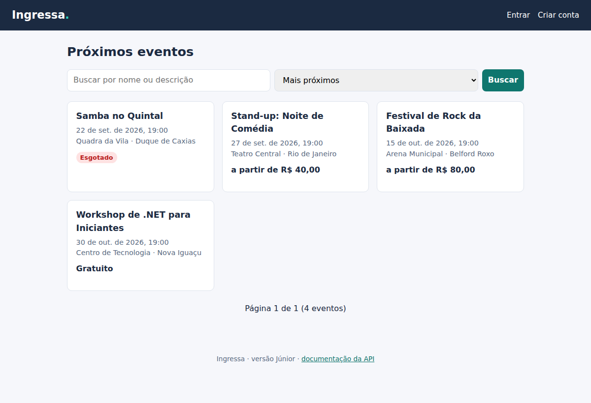
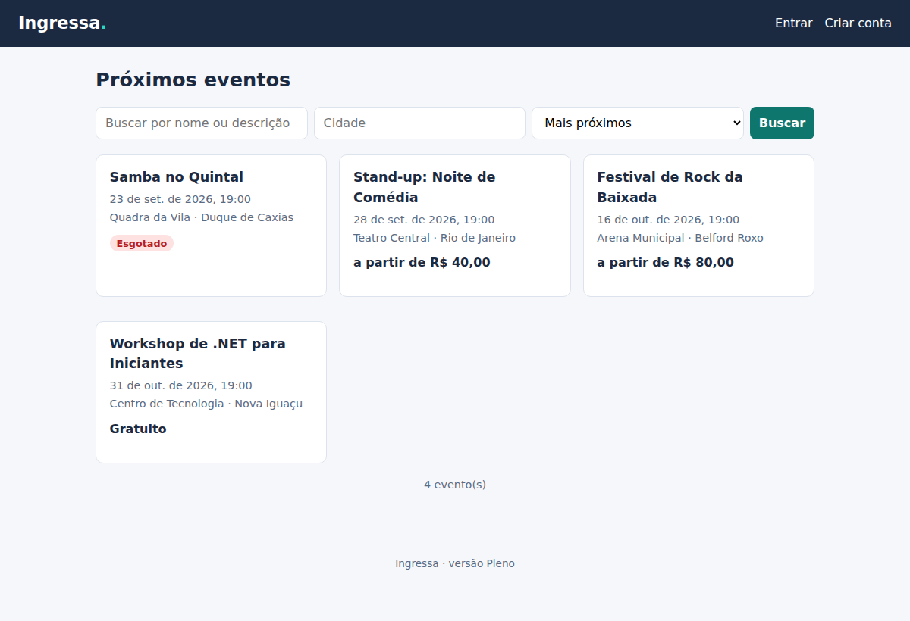
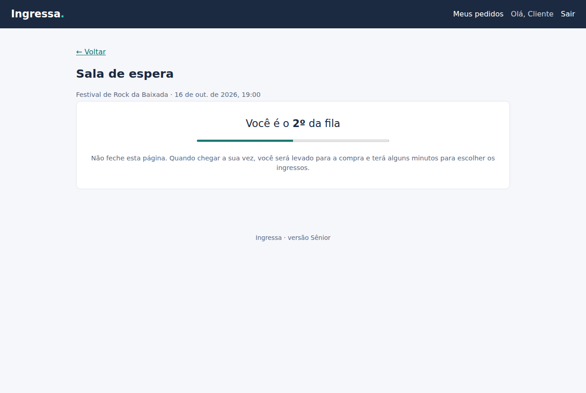

# Ingressa

**Plataforma de venda de ingressos construída em três versões — Júnior, Pleno e Sênior — para mostrar, na prática, como um sistema evolui quando os requisitos ficam mais difíceis.**

[](https://dotnet.microsoft.com/)
[](https://learn.microsoft.com/dotnet/csharp/)
[](LICENSE)

## O problema

Toda grande venda de ingressos vira notícia: site fora do ar, fila que não anda, ingresso vendido duas vezes, cambistas com robôs comprando tudo em segundos.

Por trás disso há problemas técnicos clássicos:

- **Concorrência:** duas pessoas tentando comprar o último lugar no mesmo milissegundo.
- **Picos de tráfego:** 100 mil pessoas chegando às 10h00 em ponto.
- **Consistência:** o pagamento aprovou, mas o servidor caiu antes de emitir o ingresso.
- **Justiça:** impedir que robôs passem na frente de pessoas.

O Ingressa resolve esses problemas **em etapas**, e cada etapa fica registrada no repositório.

## As três versões

| | [Júnior](junior/) | [Pleno](pleno/) | [Sênior](senior/) |
|---|---|---|---|
| **Pergunta que responde** | "Sei construir uma API correta?" | "Sei estruturar um sistema profissional?" | "Como eu prepararia esse sistema para escala e falhas?" |
| **Arquitetura** | Monólito em um projeto | Monólito em camadas + Worker | Mesmas camadas, réplicas e autoscaling (extração de serviços avaliada e descartada) |
| **Banco** | SQLite | PostgreSQL + migrations | PostgreSQL + Redis (fila, limites, cache) |
| **Concorrência** | Não tratada (limitação documentada) | UPDATE atômico + reserva com expiração | + fila virtual e idempotência |
| **Mensageria** | — | RabbitMQ + Outbox | + trace distribuído e reprocessamento de falhas |
| **Interface** | JavaScript puro | React + TypeScript | + sala de espera e testes ponta a ponta |
| **Qualidade** | Testes de unidade/serviço | + integração com banco real, CI | + carga (k6), Playwright, SAST/DAST |
| **Operação** | `dotnet run` | Docker Compose, logs estruturados | OpenTelemetry, Terraform/AWS, runbooks |
| **Status** | ✅ Concluída | ✅ Concluída | ✅ Concluída |

Cada pasta é um projeto independente, com README próprio explicando o que foi feito, como rodar e **quais limitações motivaram a versão seguinte**.

## Começando pela versão Júnior

```bash
git clone https://github.com/Helboy1977/ingressa.git
cd ingressa/junior
dotnet run --project src/Ingressa.Api --launch-profile http
# abra http://localhost:5080  (cliente@ingressa.dev / Senha@123)
```

Para a versão Pleno (precisa do Docker):

```bash
cd ../pleno                  # ou ../senior
cp .env.example .env         # troque as senhas
docker compose up --build
# abra http://localhost:8080
```

| Júnior | Pleno | Sênior |
|---|---|---|
|  |  |  |

### O mesmo problema, duas respostas

200 compras simultâneas para um setor com 10 lugares ([experimento](pleno/docs/experimentos/concorrencia-no-estoque.md)):

| Como o estoque é baixado | Compras aceitas | Lugares registrados |
|---|---|---|
| Ler → calcular → gravar (o método da Júnior) | **200** | 9 |
| `UPDATE` condicional atômico (o método da Pleno) | **10** | 10 |

O experimento roda direto no PostgreSQL, com os dois métodos, para comparar só a técnica — a versão Júnior usa SQLite, que serializa as escritas e esconde o problema.

## Estrutura do repositório

```
ingressa/
├── junior/   → API REST + EF Core + SQLite + JWT + vitrine em JavaScript
├── pleno/    → camadas, PostgreSQL, reserva e pagamento, RabbitMQ + outbox, React, Docker
├── senior/   → fila virtual, idempotência, Redis, OpenTelemetry, k6, Playwright, Terraform (AWS)
├── docs/     → decisões de arquitetura (ADRs) e roadmap
├── .github/  → CI das três versões e varreduras de segurança
└── pdf/      → estudo de caso completo (análise, decisões e evolução)
```

## Documentação

- [Estudo de caso em PDF](pdf/INGRESSA_ANALISE_E_DESENVOLVIMENTO.pdf)
- [Roadmap](docs/roadmap.md)
- [Decisões de arquitetura (ADRs)](docs/adr/)

## Autor

**Gabriel Sandre** — estudante de Análise e Desenvolvimento de Sistemas (INFNET)
[LinkedIn](https://www.linkedin.com/in/sandregabriel) · [GitHub](https://github.com/Helboy1977)

Licenciado sob a [licença MIT](LICENSE).
