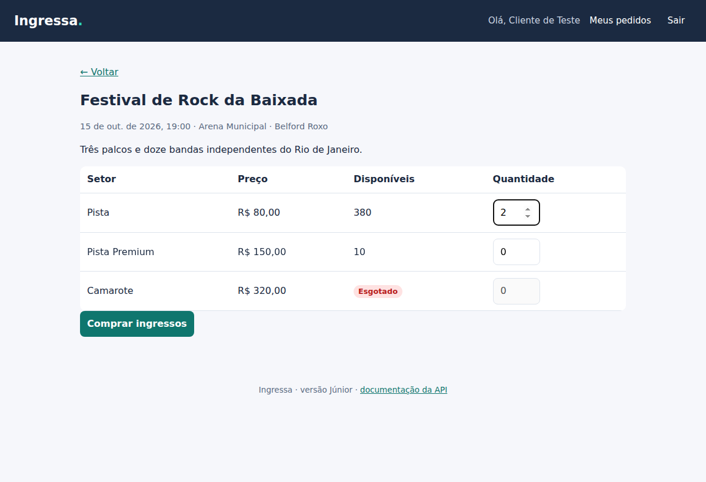
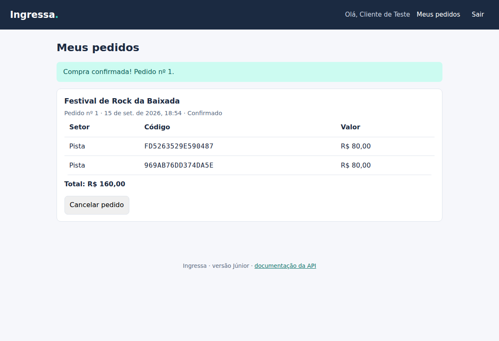
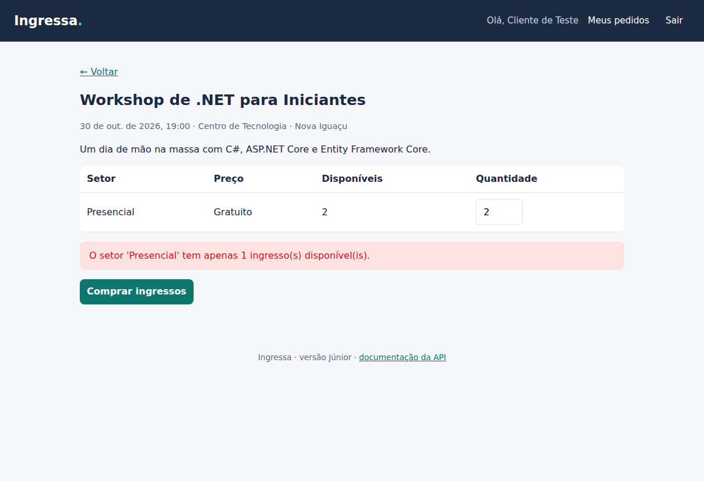
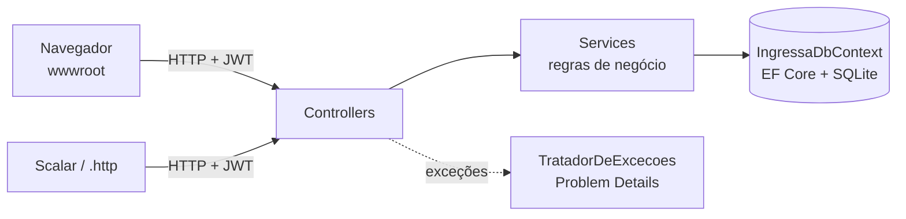
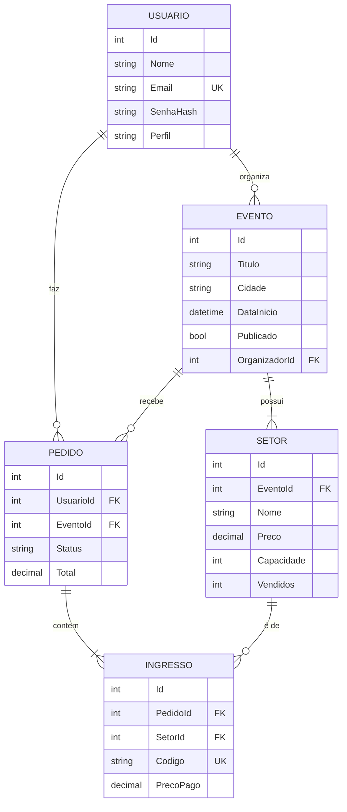

# Ingressa · Versão Júnior

> API REST de venda de ingressos em **C# / ASP.NET Core 10**, com **Entity Framework Core**, **SQLite**, autenticação **JWT** e uma vitrine em JavaScript puro.

Esta é a primeira de três versões do projeto. O objetivo aqui é mostrar **fundamentos bem feitos**: modelagem, CRUD, regras de negócio, autenticação, tratamento de erros, validação e testes. As limitações desta versão são conhecidas e estão documentadas no fim deste arquivo — elas são o ponto de partida da versão [Pleno](../pleno/).


## Sumário

- [O que a aplicação faz](#o-que-a-aplicação-faz)
- [Como rodar](#como-rodar)
- [Como testar](#como-testar)
- [Arquitetura](#arquitetura)
- [Banco de dados](#banco-de-dados)
- [Endpoints](#endpoints)
- [Segurança](#segurança)
- [Decisões técnicas](#decisões-técnicas)
- [Limitações conhecidas](#limitações-conhecidas-e-o-que-vem-na-versão-pleno)

## O que a aplicação faz

| Perfil | Pode fazer |
|---|---|
| **Visitante** | Ver a vitrine com busca, filtro por cidade, ordenação e paginação; ver detalhes do evento |
| **Cliente** | Comprar até 6 ingressos por pedido, ver os pedidos com os códigos dos ingressos, cancelar até 24 h antes do evento |
| **Organizador** | Criar eventos como rascunho, cadastrar setores (preço e capacidade), publicar, editar e excluir eventos sem vendas |

Regras de negócio implementadas:

- O estoque de cada setor é validado **antes** de qualquer alteração: se um item do pedido falhar, nada é gravado.
- O preço pago fica guardado no ingresso; mudar o preço do setor depois não altera pedidos antigos.
- Cada ingresso recebe um código de 16 caracteres gerado por um gerador criptográfico.
- Cancelar um pedido devolve os ingressos ao estoque.
- Rascunhos só são visíveis para o próprio organizador; para os demais respondem **404**.
- Um cliente nunca vê pedidos de outro cliente (também **404**, para não confirmar que o id existe).
- A capacidade de um setor não pode ficar menor que o total já vendido; eventos com vendas não podem ser excluídos.

| Detalhe do evento | Pedido confirmado | Estoque mudou enquanto a página estava aberta |
|---|---|---|
|  |  |  |

## Como rodar

**Pré-requisito:** [.NET SDK 10](https://dotnet.microsoft.com/download). Nada mais — o banco SQLite é criado sozinho.

```bash
cd junior
dotnet run --project src/Ingressa.Api --launch-profile http
```

Abra **http://localhost:5080**. Em desenvolvimento a aplicação cria dados de exemplo:

| Conta | E-mail | Senha |
|---|---|---|
| Cliente | `cliente@ingressa.dev` | `Senha@123` |
| Organizador | `organizador@ingressa.dev` | `Senha@123` |

- Documentação interativa da API (Scalar): **http://localhost:5080/scalar**
- Documento OpenAPI: `http://localhost:5080/openapi/v1.json`
- Requisições prontas: [`src/Ingressa.Api/Ingressa.Api.http`](src/Ingressa.Api/Ingressa.Api.http) (Visual Studio ou extensão REST Client do VS Code)

Para recomeçar do zero, apague o arquivo `src/Ingressa.Api/ingressa.db`.

### Configuração

| Chave (appsettings) | Variável de ambiente | Padrão | Descrição |
|---|---|---|---|
| `ConnectionStrings:Ingressa` | `ConnectionStrings__Ingressa` | `Data Source=ingressa.db` | Arquivo do SQLite |
| `Jwt:Chave` | `Jwt__Chave` | *(vazio em produção)* | Chave de assinatura, **mínimo 32 bytes** |
| `Jwt:Emissor` | `Jwt__Emissor` | `Ingressa` | Emissor do token |
| `Jwt:Audiencia` | `Jwt__Audiencia` | `Ingressa.Clientes` | Audiência do token |
| `Jwt:ExpiracaoMinutos` | `Jwt__ExpiracaoMinutos` | `60` | Validade do token (1 a 1440) |

A chave de desenvolvimento está em `appsettings.Development.json`. Fora do ambiente de desenvolvimento a aplicação **se recusa a iniciar** sem uma chave válida:

```bash
dotnet user-secrets set "Jwt:Chave" "<uma chave longa e aleatória>" --project src/Ingressa.Api
```

## Como testar

```bash
cd junior
dotnet test
```

São **54 testes** (xUnit), em duas camadas:

| Arquivo | O que cobre |
|---|---|
| `SenhaHasherTests` | hash com salt, senha errada, hash malformado, compatibilidade com hashes antigos |
| `JwtOptionsTests` | a aplicação recusa chave curta e expiração inválida |
| `AuthServiceTests` | e-mail normalizado, duplicidade, claims do token, token com outra chave é rejeitado, mensagem de erro igual para e-mail inexistente |
| `EventoServiceTests` | vitrine (publicados e futuros), busca, cidade, paginação, ordenação, preço mínimo, rascunhos, permissões, regras de setor e exclusão |
| `PedidoServiceTests` | estoque, itens repetidos, limite por pedido, evento não publicado ou passado, setor de outro evento, preço congelado, isolamento entre clientes, cancelamento |

Os testes de serviço usam um **SQLite em memória de verdade** (não um mock), criado do zero em cada teste, e um relógio fixo (`TimeProvider`) para que regras de data sejam determinísticas.

## Arquitetura

Um único projeto organizado por responsabilidade. Para o tamanho atual, mais camadas só adicionariam cerimônia.



```
junior/
├── src/Ingressa.Api/
│   ├── Controllers/   → recebem HTTP, leem o usuário do token, delegam para os serviços
│   ├── Services/      → regras de negócio (AuthService, EventoService, PedidoService)
│   ├── Models/        → entidades do domínio
│   ├── Dtos/          → contratos de entrada e saída, com validação (DataAnnotations)
│   ├── Data/          → DbContext, mapeamento e dados de exemplo
│   ├── Auth/          → hash de senha, geração e validação de JWT
│   ├── Erros/         → exceções de domínio e conversão para Problem Details
│   └── wwwroot/       → vitrine em HTML, CSS e JavaScript
└── tests/Ingressa.Api.Tests/
```

**Fluxo de uma compra:** `PedidosController` → `PedidoService.CriarAsync` agrupa itens repetidos, valida o limite, carrega o evento com os setores, valida **todos** os itens, baixa o estoque, cria os ingressos e grava tudo em um único `SaveChanges`.

## Banco de dados



- Índices: e-mail único, código do ingresso único e `(Publicado, DataInicio)` para a vitrine.
- Excluir um evento remove os setores (cascata); usuários e setores com ingressos são protegidos (`Restrict`).
- Todas as datas são gravadas em UTC.
- O esquema é criado com `EnsureCreated()` — simples para começar; a versão Pleno usa migrations.

## Endpoints

| Método | Rota | Acesso | Descrição |
|---|---|---|---|
| POST | `/api/auth/registrar` | público | Cria conta (`Cliente` ou `Organizador`) |
| POST | `/api/auth/login` | público | Retorna o token JWT |
| GET | `/api/eventos` | público | Vitrine: `busca`, `cidade`, `ordem` (`Data`/`Titulo`), `pagina`, `tamanhoPagina` (1–50) |
| GET | `/api/eventos/{id}` | público | Detalhe com setores |
| GET | `/api/eventos/meus` | organizador | Eventos do organizador, inclusive rascunhos |
| POST | `/api/eventos` | organizador | Cria rascunho |
| PUT | `/api/eventos/{id}` | dono | Atualiza |
| DELETE | `/api/eventos/{id}` | dono | Exclui (só sem vendas) |
| POST | `/api/eventos/{id}/publicar` | dono | Publica (exige ao menos um setor) |
| POST | `/api/eventos/{id}/setores` | dono | Adiciona setor |
| PUT | `/api/eventos/{id}/setores/{setorId}` | dono | Atualiza setor |
| DELETE | `/api/eventos/{id}/setores/{setorId}` | dono | Remove setor (só sem vendas) |
| POST | `/api/pedidos` | cliente | Compra ingressos |
| GET | `/api/pedidos` | cliente | Meus pedidos |
| GET | `/api/pedidos/{id}` | cliente | Detalhe do pedido |
| POST | `/api/pedidos/{id}/cancelar` | cliente | Cancela e devolve ao estoque |

Erros seguem o padrão **Problem Details** ([RFC 9457](https://www.rfc-editor.org/rfc/rfc9457)):

| Status | Quando |
|---|---|
| 400 | Dados inválidos (validação) |
| 401 | Sem token, token inválido ou login incorreto |
| 403 | Perfil errado ou recurso de outro organizador |
| 404 | Não existe (ou o usuário não pode saber que existe) |
| 409 | Conflito com o estado atual: e-mail em uso, setor esgotado, evento com vendas |
| 422 | Regra de negócio: data no passado, publicar sem setores, cancelar em cima da hora |

```json
{
  "status": 409,
  "title": "Conflito",
  "detail": "O setor 'Camarote' está esgotado."
}
```

## Segurança

| Risco | Medida |
|---|---|
| Vazamento de senhas | PBKDF2-HMAC-SHA256 com 600 mil iterações (recomendação OWASP), salt de 16 bytes, comparação em tempo constante |
| Descobrir quais e-mails existem | Mesma mensagem e mesmo custo de processamento para e-mail inexistente e senha errada |
| Token forjado | Assinatura HS256 validada, com emissor, audiência e expiração; a aplicação não inicia com chave fraca |
| Acesso a dados de terceiros | Toda consulta filtra pelo id do usuário que vem do token, nunca do corpo da requisição |
| XSS na vitrine | Todo texto vindo da API é escapado antes de entrar no HTML |
| Vazamento de detalhes internos | Erros 500 retornam mensagem genérica; o detalhe vai só para o log |
| Adivinhar códigos de ingresso | 64 bits de um gerador criptográfico (`RandomNumberGenerator`) |
| Transporte | HTTPS com HSTS fora do ambiente de desenvolvimento |

## Decisões técnicas

| Decisão | Alternativa considerada | Por quê |
|---|---|---|
| ASP.NET Core **Web API** com controllers | Minimal APIs | Controllers deixam a organização mais evidente para quem está começando e facilitam atributos de autorização e documentação por endpoint |
| **SQLite** | PostgreSQL / SQL Server | Zero instalação: qualquer pessoa clona e roda. A troca para PostgreSQL acontece na versão Pleno, quando a concorrência passa a importar |
| Serviços usando o `DbContext` diretamente | Padrão Repository | O `DbContext` já é uma unidade de trabalho com repositórios (`DbSet`). Um repositório por cima só repetiria métodos |
| **JWT** próprio | ASP.NET Core Identity | Mostra o mecanismo por dentro (hash, claims, assinatura). O Identity é avaliado na versão Pleno |
| `TimeProvider` injetado | `DateTime.UtcNow` direto | Permite testar regras de data (24 h, evento passado) sem esperar o tempo passar |
| Exceções de domínio + `IExceptionHandler` | `try/catch` em cada controller | Um único lugar decide o status HTTP; controllers ficam com uma linha cada |
| Vitrine em **JavaScript puro** | React | O foco desta versão é o backend. A interface existe para demonstrar a API; a Pleno migra para React + TypeScript |
| Testes com **SQLite em memória** | EF Core InMemory / mocks | O provedor InMemory não é um banco relacional e esconde erros reais de tradução de consultas |

## Limitações conhecidas (e o que vem na versão Pleno)

Estas limitações são **intencionais** nesta etapa e cada uma motiva uma evolução:

1. **Venda duplicada sob concorrência.** A baixa de estoque lê, altera e grava (`Vendidos += n`) sem controle de concorrência. Duas compras simultâneas do último ingresso podem ser aceitas. → *Pleno: concorrência otimista, PostgreSQL e teste de carga que prova a correção.*
2. **Sem reserva temporária.** A compra é instantânea; na vida real o cliente segura o ingresso por alguns minutos enquanto paga. → *Pleno: reserva com expiração e pagamento simulado.*
3. **Tudo em um projeto.** Funciona agora, mas regras de negócio, banco e HTTP estão no mesmo lugar. → *Pleno: camadas Domain / Application / Infrastructure / Api.*
4. **Token sem renovação e guardado no `sessionStorage`.** → *Pleno: refresh token com rotação.*
5. **Qualquer pessoa pode se cadastrar como organizador.** → *Pleno: perfil administrador que aprova organizadores.*
6. **Sem Docker, CI ou logs estruturados.** → *Pleno: Docker Compose, GitHub Actions e Serilog.*
7. **Esquema criado por `EnsureCreated()`.** → *Pleno: migrations versionadas.*

---

[← Visão geral do projeto](../README.md) · Próxima versão: [Pleno →](../pleno/)
