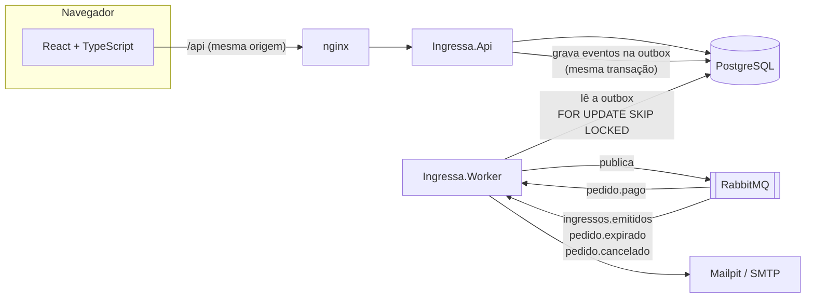
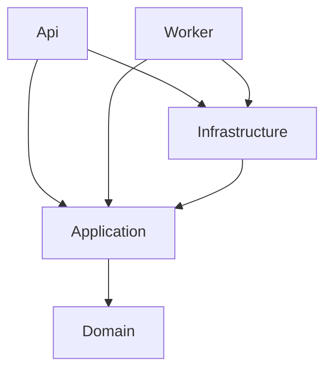
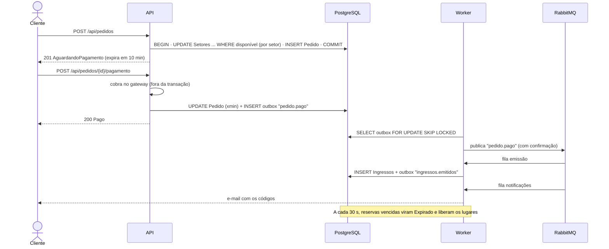
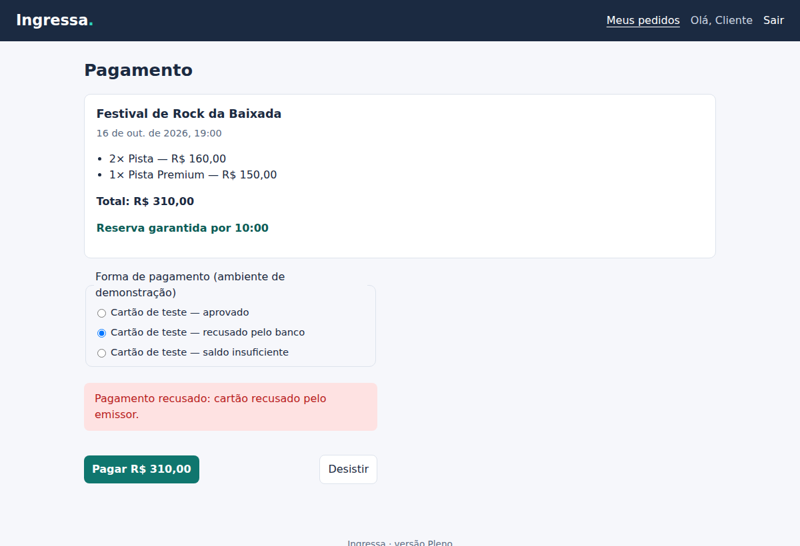
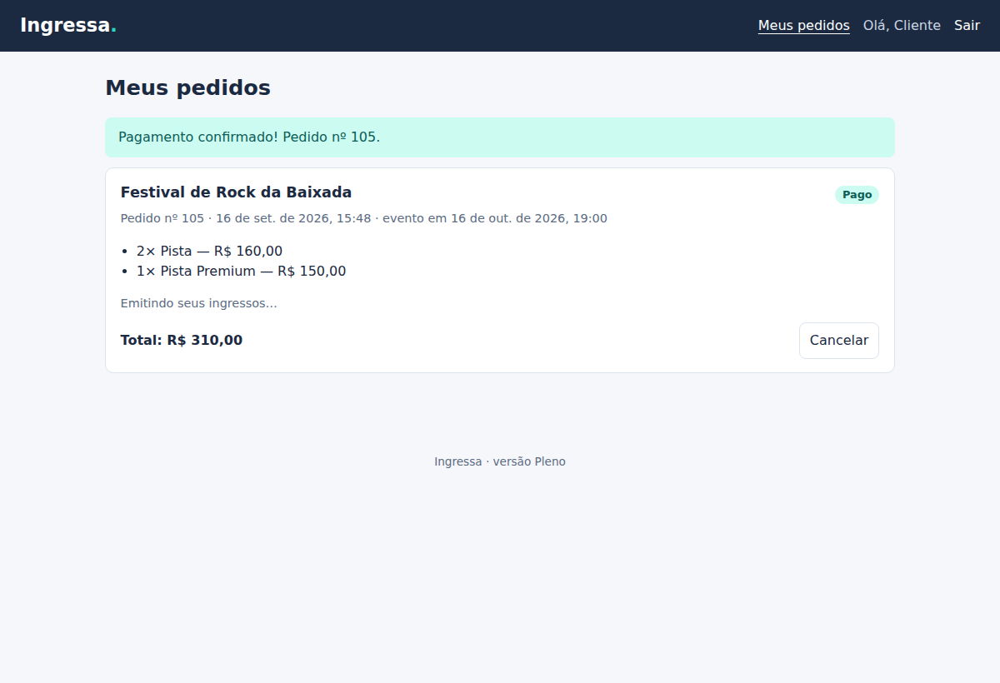
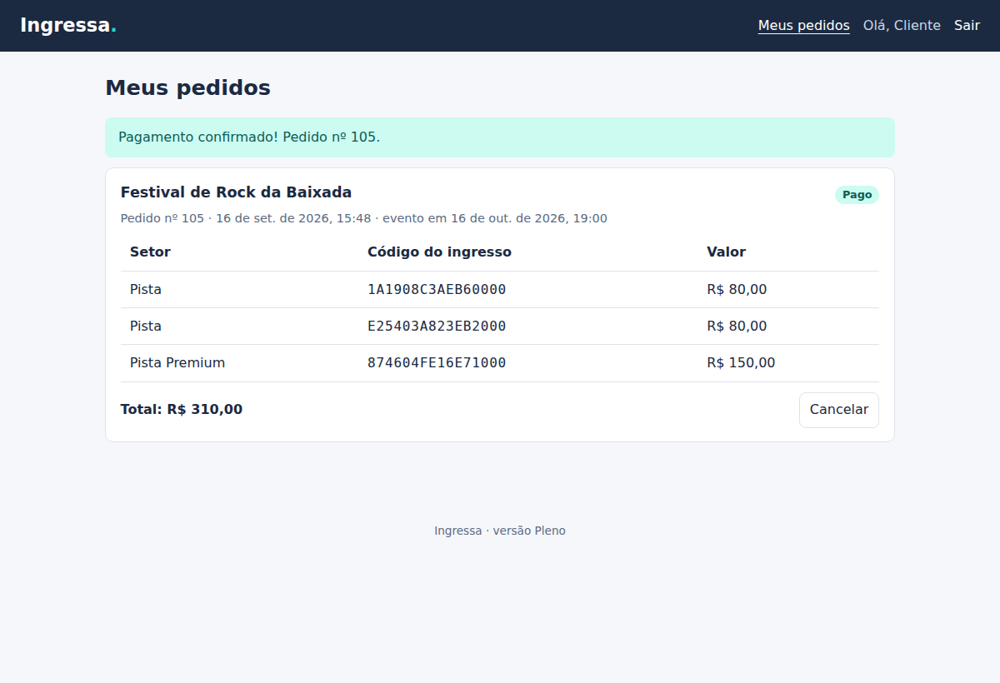
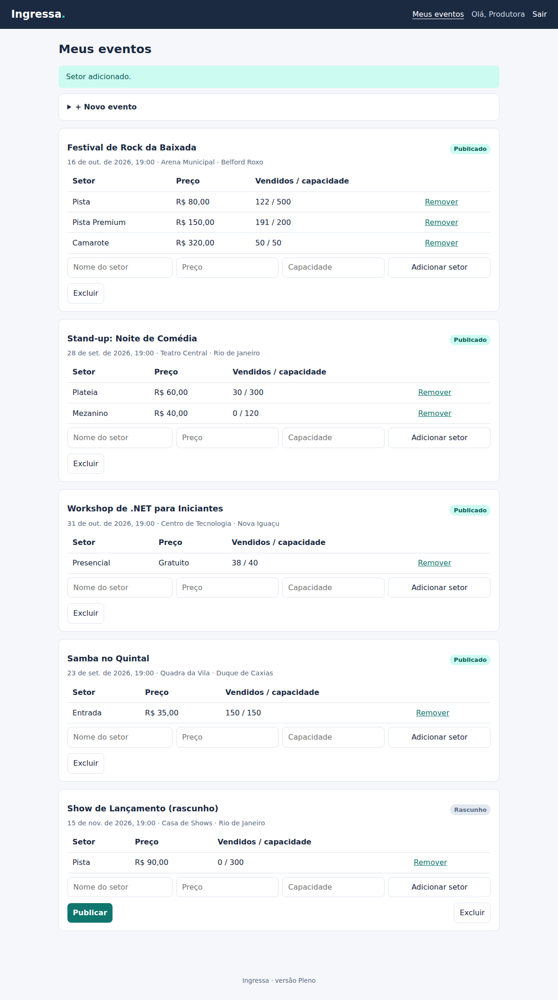
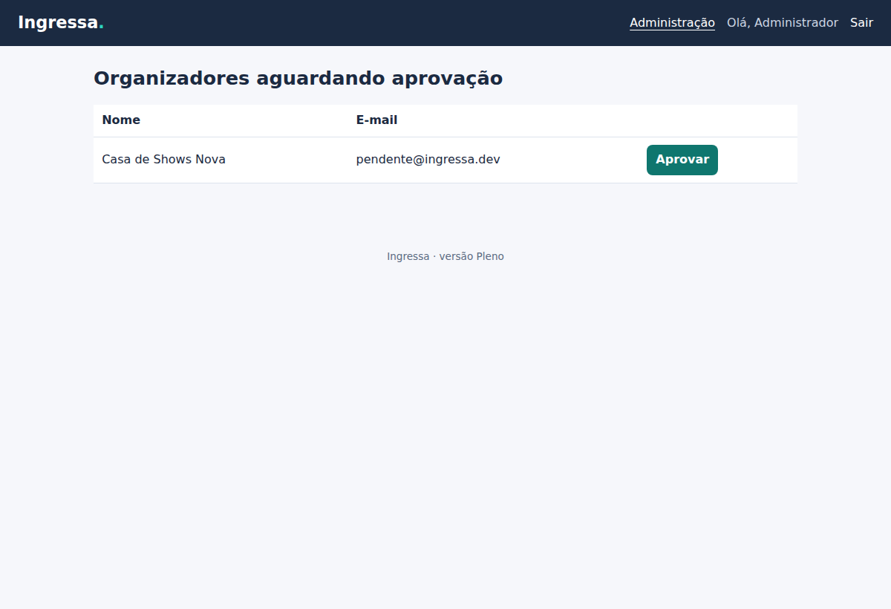

# Ingressa · Versão Pleno

> A versão Júnior funcionava, mas **vendia ingresso a mais** quando duas pessoas compravam ao mesmo tempo. Esta versão reorganiza o sistema em camadas, corrige a concorrência com PostgreSQL, adiciona reserva com prazo, pagamento, mensageria confiável, sessão segura e uma interface em React — tudo rodando com um `docker compose up`.


## Sumário

- [O que mudou em relação à Júnior](#o-que-mudou-em-relação-à-júnior)
- [Como rodar](#como-rodar)
- [Como testar](#como-testar)
- [Arquitetura](#arquitetura)
- [O fluxo de uma compra](#o-fluxo-de-uma-compra)
- [Concorrência](#concorrência)
- [Mensageria e outbox](#mensageria-e-outbox)
- [Segurança](#segurança)
- [Observabilidade](#observabilidade)
- [Endpoints](#endpoints)
- [Decisões técnicas](#decisões-técnicas)
- [Limitações e próximos passos](#limitações-conhecidas-e-o-que-vem-na-versão-sênior)

## O que mudou em relação à Júnior

| Limitação da Júnior | Solução na Pleno |
|---|---|
| Venda duplicada sob concorrência | `UPDATE` atômico e condicional + restrição `CHECK` no banco ([experimento](docs/experimentos/concorrencia-no-estoque.md)) |
| Compra instantânea, sem pagamento | Reserva de 10 minutos → pagamento (gateway simulado) → emissão assíncrona; reservas vencidas liberam os lugares |
| Tudo em um projeto | Domain · Application · Infrastructure · Api · Worker |
| SQLite e `EnsureCreated` | PostgreSQL 17 com migrations |
| Token sem renovação, no `sessionStorage` | Access token de 15 min só em memória + refresh token rotativo em cookie `HttpOnly`, com detecção de roubo |
| Qualquer um vira organizador | Organizadores aguardam aprovação de um administrador |
| Sem proteção contra força bruta | Bloqueio da conta após 5 erros + limite de requisições por IP |
| E-mail e tarefas lentas dentro da requisição | RabbitMQ + padrão *Transactional Outbox* + Worker |
| Sem Docker, CI e logs estruturados | Docker Compose, GitHub Actions, logs JSON com correlação, health checks |
| Vitrine em JavaScript puro | React 19 + TypeScript + React Router, com testes |

## Como rodar

### Tudo em containers (recomendado)

Pré-requisito: **Docker Desktop**.

```bash
cd pleno
docker compose up --build
```

| Endereço | O que é |
|---|---|
| http://localhost:8080 | Interface (React) |
| http://localhost:5180/scalar | Documentação interativa da API |
| http://localhost:15672 | Painel do RabbitMQ (`ingressa` / `ingressa`) |
| http://localhost:8025 | Caixa de e-mails de teste (Mailpit) |

Contas de demonstração (senha `Senha@123`):

| E-mail | Perfil |
|---|---|
| `cliente@ingressa.dev` | Cliente |
| `organizador@ingressa.dev` | Organizador aprovado |
| `pendente@ingressa.dev` | Organizador aguardando aprovação |
| `admin@ingressa.dev` | Administrador |

No pagamento, escolha um dos cartões de teste: aprovado, recusado ou sem saldo.

### Desenvolvendo localmente

```bash
cd pleno
docker compose up -d postgres rabbitmq mailpit     # só a infraestrutura
dotnet run --project src/Ingressa.Api --launch-profile http      # API em :5180
dotnet run --project src/Ingressa.Worker --launch-profile http   # outro terminal
cd web && npm install && npm run dev                              # interface em :5173
```

### Migrations

```bash
dotnet tool restore
dotnet ef migrations add NomeDaMudanca -p src/Ingressa.Infrastructure -s src/Ingressa.Api -o Persistencia/Migrations
```

A API aplica as migrations pendentes ao iniciar (`Banco:InicializarAoIniciar`). O CI falha se o modelo mudar sem migration.

### Configuração

| Chave | Variável de ambiente | Descrição |
|---|---|---|
| `ConnectionStrings:Ingressa` | `ConnectionStrings__Ingressa` | PostgreSQL |
| `Jwt:Chave` | `Jwt__Chave` | Chave de assinatura (mínimo 32 bytes; obrigatória) |
| `Jwt:ExpiracaoMinutos` | `Jwt__ExpiracaoMinutos` | Validade do access token (padrão 15) |
| `Admin:Email` / `Admin:Senha` | `Admin__Email` / `Admin__Senha` | Cria a conta de administrador na primeira execução |
| `Banco:DadosDeDemonstracao` | `Banco__DadosDeDemonstracao` | Insere eventos e contas de exemplo |
| `LimiteDeRequisicoes:AutenticacaoPorMinuto` | `LimiteDeRequisicoes__AutenticacaoPorMinuto` | Tentativas de login/cadastro por IP (padrão 10) |
| `RabbitMq:*` | `RabbitMq__Host`, `RabbitMq__Senha`... | Conexão do Worker |
| `Email:*` | `Email__Host`, `Email__Porta` | SMTP do Worker |
| `Expiracao:IntervaloEmSegundos` | `Expiracao__IntervaloEmSegundos` | Frequência da limpeza de reservas (padrão 30) |

## Como testar

```bash
cd pleno
dotnet test              # precisa do Docker aberto (testes de integração)
cd web && npm test       # interface
```

| Projeto | Tipo | O que cobre |
|---|---|---|
| `Ingressa.Domain.Tests` | Unidade (43) | Regras das entidades: máquina de estados do pedido, bloqueio de conta, validações de evento e setor, idempotência da emissão |
| `Ingressa.Application.Tests` | Casos de uso (34) | Reserva com rollback, 50 compras paralelas, pagamento recusado, estorno quando a reserva expira durante a cobrança, expiração, rotação e roubo de refresh token |
| `Ingressa.Api.IntegrationTests` | Integração | API real + **PostgreSQL real** (Testcontainers): 40 clientes disputando 5 lugares, concorrência otimista, fluxo completo, cookie `HttpOnly`/`Secure`/`SameSite`, autorização por perfil, limite de requisições, busca com `%` |
| `web` (Vitest) | Interface (11) | Renovação automática de sessão, uma única renovação para chamadas simultâneas, mensagens de erro, vitrine |

## Arquitetura



Dependências entre projetos (as setas apontam para quem é conhecido):



| Projeto | Responsabilidade | Depende de |
|---|---|---|
| `Ingressa.Domain` | Entidades e regras (`Evento`, `Setor`, `Pedido`, `Usuario`), eventos de domínio | nada |
| `Ingressa.Application` | Casos de uso e interfaces (portas) que a infraestrutura implementa | Domain |
| `Ingressa.Infrastructure` | EF Core/PostgreSQL, estoque atômico, outbox, RabbitMQ, SMTP, gateway simulado | Application |
| `Ingressa.Api` | HTTP, autenticação JWT, cookies, limites, Problem Details | Application, Infrastructure |
| `Ingressa.Worker` | Despacho da outbox, consumidores, expiração de reservas | Application, Infrastructure |
| `web` | Interface React | API via HTTP |

As entidades protegem as próprias regras: propriedades com `private set`, criação por métodos (`Evento.Criar`, `Pedido.Reservar`) e coleções expostas como somente leitura. O domínio não conhece EF Core, HTTP nem RabbitMQ.

## O fluxo de uma compra





| Emitindo em segundo plano | Ingressos emitidos |
|---|---|
|  |  |

## Concorrência

Três problemas diferentes, três soluções diferentes:

| Problema | Solução | Onde |
|---|---|---|
| Duas compras do último lugar | `UPDATE ... SET Ocupados = Ocupados + n WHERE Capacidade - Ocupados >= n` — o banco decide de forma atômica | `Estoque.cs` |
| Um bug ocupar lugares demais | `CHECK (Ocupados BETWEEN 0 AND Capacidade)` | `EventoConfiguracao.cs` |
| Pagar e expirar o mesmo pedido ao mesmo tempo | Concorrência otimista com a coluna `xmin` do PostgreSQL: a segunda gravação falha e vira `409` | `PedidoConfiguracao.cs`, `UnidadeDeTrabalho.cs` |
| Reserva expira enquanto o gateway processa | O pagamento aprovado é estornado automaticamente | `PedidoService.PagarAsync` |
| Vários Workers lendo a outbox | `FOR UPDATE SKIP LOCKED` | `DespachanteDaOutbox.cs` |

O [experimento com PostgreSQL](docs/experimentos/concorrencia-no-estoque.md) mostra 200 compras simultâneas para 10 lugares: o método da Júnior aceita **200**; o da Pleno aceita **10**.

## Mensageria e outbox

Publicar no RabbitMQ logo depois de gravar no banco tem um buraco: se o processo cair entre as duas coisas, o pedido fica pago e ninguém emite os ingressos.

O padrão **Transactional Outbox** fecha esse buraco:

1. A entidade registra um evento de domínio (`PedidoPago`).
2. O `DbContext` transforma o evento em uma linha da tabela `MensagensOutbox` **no mesmo `SaveChanges`** — ou grava os dois, ou nenhum.
3. O `DespachanteDaOutbox` publica as linhas pendentes com *publisher confirms* e só então as marca como publicadas.
4. Os consumidores são **idempotentes** (`EmitirIngressos` não emite duas vezes), porque a entrega é "pelo menos uma vez".
5. Mensagens que falham 5 vezes vão para a fila `ingressa.falhas` (dead letter) em vez de travar a fila.

| Exchange / fila | Tipo | Mensagens |
|---|---|---|
| `ingressa.eventos` | topic | todas |
| `ingressa.emissao-ingressos` | quorum | `pedido.pago` |
| `ingressa.notificacoes` | quorum | `ingressos.emitidos`, `pedido.expirado`, `pedido.cancelado` |
| `ingressa.falhas` | quorum | mensagens que esgotaram as tentativas |

## Segurança

| Risco | Medida |
|---|---|
| Roubo do token por script injetado (XSS) | Access token só em memória; refresh token em cookie `HttpOnly` |
| Uso do cookie por outro site (CSRF) | `SameSite=Strict`, `Path=/api/auth`, API e interface na mesma origem |
| Token de renovação roubado | Rotação a cada uso; reutilização revoga a família inteira de tokens |
| Refresh token vazado do banco | Guardado apenas como hash SHA-256 |
| Força bruta e *credential stuffing* | Bloqueio de 15 min após 5 erros + 10 tentativas/min por IP (429) |
| Descoberta de e-mails cadastrados | Mesma mensagem e mesmo custo para e-mail inexistente |
| Organizadores falsos | Aprovação por administrador; admin não pode ser criado pelo cadastro |
| Dados de cartão | A aplicação só recebe um token do gateway (modelo exigido pelo PCI DSS) |
| Injeção em buscas | Consultas parametrizadas; `%` e `_` digitados são escapados no `ILIKE` |
| Acesso a dados de terceiros | Pedido de outra pessoa responde 404; eventos só por quem os criou |
| Clickjacking, *MIME sniffing* | `X-Frame-Options: DENY`, `X-Content-Type-Options: nosniff`, CSP no nginx |
| Contêiner comprometido | Imagens rodam com usuário sem privilégios (`$APP_UID`) |
| Segredos no repositório | Nenhum: `user-secrets`, variáveis de ambiente e `.env` (ignorado pelo Git) |

## Observabilidade

- **Logs estruturados em JSON** fora do ambiente de desenvolvimento, com escopos (`MensagemId`, `CorrelacaoId`, `TipoMensagem`).
- **Correlação de ponta a ponta:** o `TraceId` da requisição é gravado na outbox, enviado como `CorrelationId` no RabbitMQ e registrado pelo consumidor. A resposta HTTP devolve o mesmo valor no cabeçalho `X-Trace-Id`.
- **Health checks:** `/health/live` (processo no ar) e `/health/ready` (PostgreSQL acessível; no Worker, também o RabbitMQ).

Métricas, *tracing* distribuído e painéis ficam para a versão Sênior.

## Endpoints

| Método | Rota | Acesso | Descrição |
|---|---|---|---|
| POST | `/api/auth/registrar` | público* | Cria conta (organizadores ficam pendentes) |
| POST | `/api/auth/login` | público* | Access token + cookie de sessão |
| POST | `/api/auth/renovar` | cookie | Nova sessão (rotação) |
| POST | `/api/auth/sair` | cookie | Revoga a sessão |
| GET | `/api/auth/eu` | autenticado | Dados da conta |
| GET | `/api/eventos` | público | Vitrine: `busca`, `cidade`, `ordem` (`Data`, `Titulo`, `Preco`), `pagina`, `tamanhoPagina` |
| GET | `/api/eventos/{id}` | público | Detalhe |
| GET/POST/PUT/DELETE | `/api/eventos/...` | organizador aprovado e dono | Gestão de eventos e setores, publicação |
| POST | `/api/pedidos` | cliente | Reserva por 10 minutos |
| POST | `/api/pedidos/{id}/pagamento` | cliente | Paga com `tok_aprovado`, `tok_recusado` ou `tok_sem_saldo` |
| POST | `/api/pedidos/{id}/cancelar` | cliente | Cancela (pago: até 24 h antes) |
| GET | `/api/pedidos`, `/api/pedidos/{id}` | cliente | Pedidos e ingressos |
| GET | `/api/admin/organizadores/pendentes` | admin | Contas aguardando aprovação |
| POST | `/api/admin/organizadores/{id}/aprovar` | admin | Aprova organizador |
| GET | `/health/live`, `/health/ready` | público | Saúde |

\* com limite de requisições por IP.

| Painel do organizador | Aprovação pelo administrador |
|---|---|
|  |  |

## Decisões técnicas

As decisões principais estão registradas em [ADRs](../docs/adr/):

| ADR | Decisão |
|---|---|
| [0004](../docs/adr/0004-camadas-sem-microsservicos.md) | Monólito em camadas com um Worker separado, e não microsserviços |
| [0005](../docs/adr/0005-postgresql-e-update-atomico.md) | PostgreSQL e `UPDATE` condicional para o estoque |
| [0006](../docs/adr/0006-outbox-e-rabbitmq.md) | Transactional Outbox + RabbitMQ |
| [0007](../docs/adr/0007-sessao-com-refresh-token-em-cookie.md) | Sessão com refresh token rotativo em cookie `HttpOnly` |
| [0008](../docs/adr/0008-repositorios-e-consultas-separadas.md) | Repositórios para escrita, consultas projetadas para leitura |

O que **não** foi adicionado, e por quê:

| Tecnologia | Por que não agora |
|---|---|
| MediatR / CQRS completo | Com cinco serviços de aplicação, chamar o serviço direto é mais simples de ler e testar |
| AutoMapper | Os mapeamentos são poucos e explícitos; um erro de mapeamento aparece na compilação |
| Redis | A vitrine é uma consulta indexada; cache só entra com uma medição que o justifique (Sênior) |
| ASP.NET Core Identity | O fluxo de sessão com rotação foi construído e testado explicitamente; o Identity é reavaliado no projeto Sentinela |
| Microsserviços | Ver ADR 0004 |

## Limitações conhecidas (e o que vem na versão Sênior)

1. **Pico de acesso.** 100 mil pessoas às 10h derrubariam a API antes de chegar ao banco. → *Sênior: fila virtual (sala de espera) e testes de carga com k6.*
2. **Robôs.** O limite por IP não segura uma rede de robôs distribuída. → *Sênior: limites por usuário e por evento, desafios e sinais de abuso.*
3. **Pagamento sem idempotência de ponta a ponta.** Um clique duplo muito rápido gera duas cobranças no gateway; a segunda é detectada pela concorrência otimista e estornada, mas o ideal é nem chegar a cobrar. → *Sênior: chave de idempotência por requisição.*
4. **Visibilidade limitada.** Há logs e health checks, mas não métricas nem *tracing*. → *Sênior: OpenTelemetry com painéis e alertas.*
5. **Sem ambiente de nuvem.** → *Sênior: Terraform na AWS, backups e plano de recuperação.*
6. **Duas abas renovando a sessão no mesmo instante** podem ser interpretadas como reuso de token e encerrar a sessão. → *Sênior: janela de tolerância curta para o token recém-substituído.*
7. **Frontend sem testes ponta a ponta automatizados no CI.** → *Sênior: Playwright.*

---

[← Versão Júnior](../junior/) · [Visão geral](../README.md) · Próxima versão: Sênior
