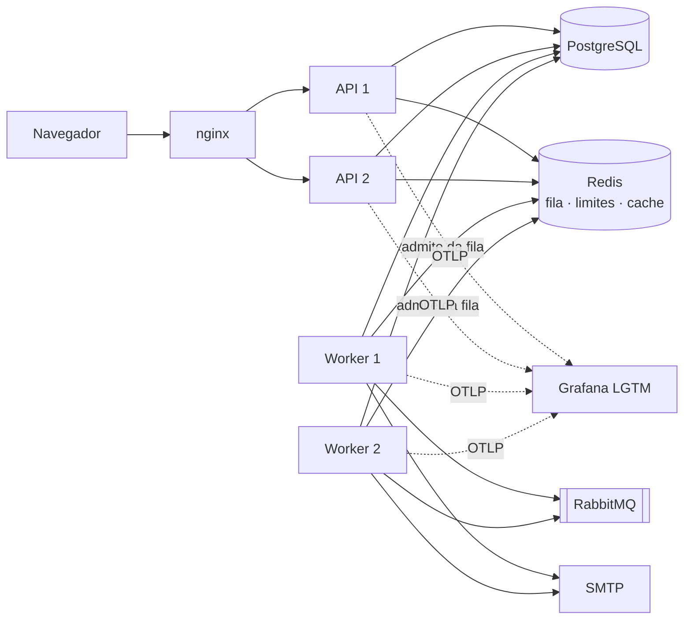
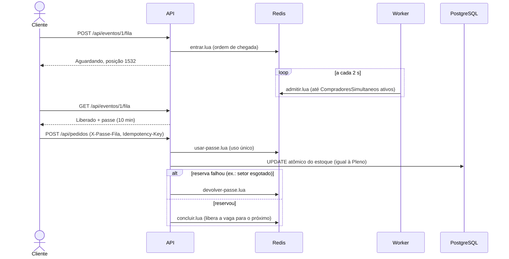
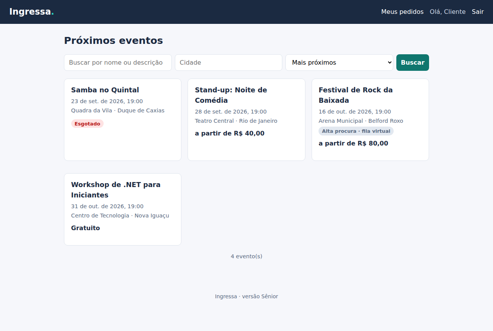
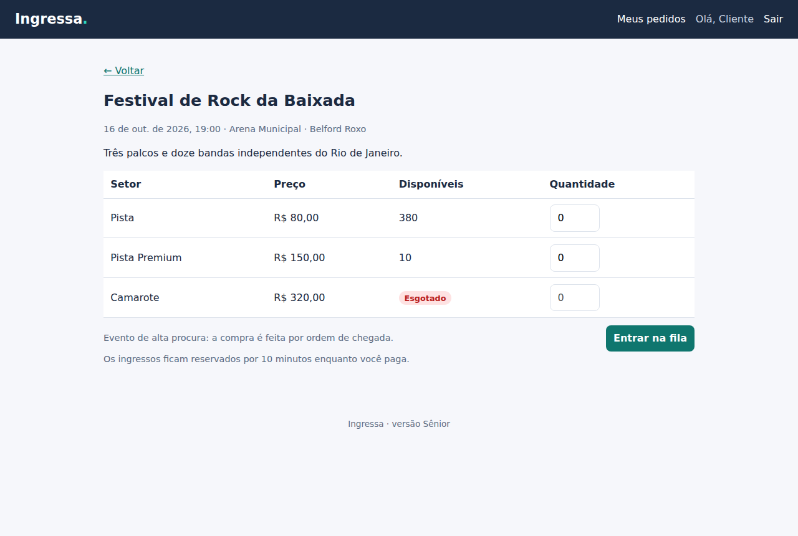
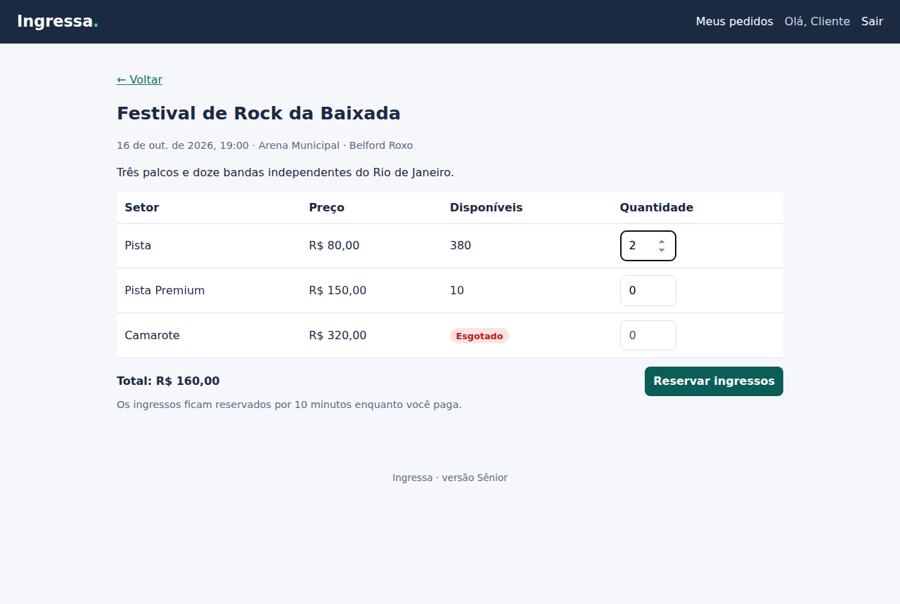
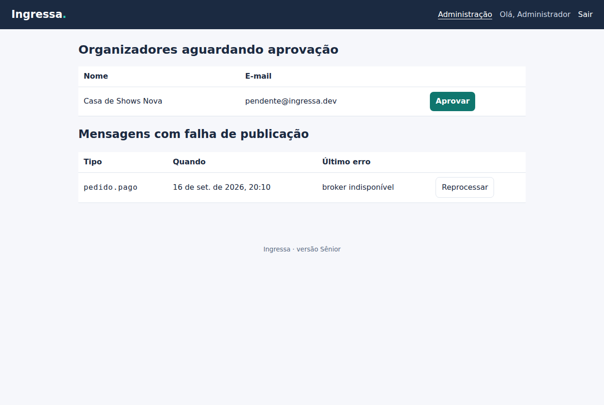

# Ingressa · Versão Sênior

> A Pleno vendia certo, mas não aguentaria a abertura de vendas de um show disputado: todos batendo no banco ao mesmo tempo, sem ordem de chegada, sem visibilidade do que acontece em produção. Esta versão prepara o sistema para **pico de acesso**: sala de espera, cache, idempotência, limites distribuídos, telemetria, testes de carga e um ambiente de produção descrito em código.


## Sumário

- [O que mudou em relação à Pleno](#o-que-mudou-em-relação-à-pleno)
- [Como rodar](#como-rodar)
- [Como testar](#como-testar)
- [Arquitetura](#arquitetura)
- [Fila virtual](#fila-virtual)
- [Resiliência a repetições e picos](#resiliência-a-repetições-e-picos)
- [Observabilidade](#observabilidade)
- [Produção na AWS](#produção-na-aws)
- [Segurança](#segurança)
- [Operação](#operação)
- [Endpoints novos](#endpoints-novos)
- [Decisões técnicas](#decisões-técnicas)
- [Limitações conhecidas](#limitações-conhecidas)

## O que mudou em relação à Pleno

| Limitação da Pleno | Solução na Sênior |
|---|---|
| Na abertura de vendas, todos disputam o banco ao mesmo tempo | **Fila virtual** no Redis (scripts Lua atômicos) com número máximo de compradores simultâneos por evento |
| Clique duplo ou queda de rede podia criar duas reservas | Cabeçalho **`Idempotency-Key`** em reservar e pagar; a repetição recebe a resposta original |
| Limite de requisições em memória: com 2 réplicas, o limite dobrava | **Limites distribuídos** no Redis + limitador global por IP |
| Toda leitura da vitrine ia ao banco | **HybridCache** (memória + Redis) com invalidação por *tag* |
| Só logs com correlação | **OpenTelemetry**: traces da requisição até o Worker, métricas de negócio, Grafana local |
| Trocar a chave JWT derrubava todas as sessões | **Rotação** com chaves anteriores aceitas; tolerância de 10 s para renovações simultâneas (várias abas) |
| Outbox e sessões crescendo para sempre | **Limpeza** periódica; painel do admin para **reprocessar** mensagens com falha |
| Uma instância de cada serviço | 2 réplicas de API e Worker atrás do nginx (compose) e autoscaling (AWS) |
| Sem medição de desempenho | **k6** com metas (SLOs) que reprovam o teste |
| Sem ambiente de produção | **Terraform** para AWS (ECS Fargate, RDS, ElastiCache, Amazon MQ, WAF, backups) |
| CI só com build e testes | Playwright ponta a ponta, k6, CodeQL, gitleaks, Trivy, checkov, ZAP |

## Como rodar

Pré-requisitos: **Docker Desktop** e acesso à internet na primeira execução (as imagens
baixam pacotes e o certificado do RDS).

```bash
cd senior
cp .env.example .env      # troque as senhas; o .env não vai para o Git
docker compose up --build
```

| Endereço | O que é |
|---|---|
| http://localhost:8080 | Interface (nginx → 2 réplicas da API) |
| http://localhost:8080/scalar | Documentação da API (com `AMBIENTE=Development`) |
| http://localhost:3000 | Grafana: traces, métricas e logs |
| http://localhost:15672 | RabbitMQ (usuário `ingressa`, senha do `.env`) |
| http://localhost:8025 | E-mails de teste (Mailpit) |

Contas de demonstração: `cliente@`, `organizador@`, `pendente@` e `admin@ingressa.dev`, senha `Senha@123`
(criadas só quando `DADOS_DE_DEMONSTRACAO` é `true`, o padrão do compose).
O **Festival de Rock da Baixada** usa fila virtual.

### Desenvolvendo localmente

```bash
cd senior
docker compose up -d postgres redis rabbitmq mailpit observabilidade
# As senhas são as do .env (no PowerShell: $env:ConnectionStrings__Redis = "...")
export ConnectionStrings__Ingressa="Host=localhost;Database=ingressa;Username=ingressa;Password=<POSTGRES_PASSWORD>"
export ConnectionStrings__Redis="localhost:6379,password=<REDIS_PASSWORD>"
export RabbitMq__Senha=<RABBITMQ_PASSWORD>
export Otlp__Endpoint=http://localhost:4317   # opcional
dotnet run --project src/Ingressa.Api --launch-profile http
dotnet run --project src/Ingressa.Worker --launch-profile http
cd web && npm install && npm run dev
```

Sem `Jwt:Chave`, a API em Development gera uma chave temporária; em qualquer outro ambiente ela não sobe.
As portas dos serviços de apoio só são publicadas em `127.0.0.1`.

### Configuração nova

| Chave | Variável | Descrição |
|---|---|---|
| `ConnectionStrings:Redis` | `ConnectionStrings__Redis` | Redis (fila, limites, cache) |
| `LimitesDistribuidos:{politica}:Limite` | `LimitesDistribuidos__reservas__Limite` | Políticas `autenticacao`, `reservas`, `fila`, `fila-consulta` |
| `LimiteDeRequisicoes:GlobalPorMinuto` | `LimiteDeRequisicoes__GlobalPorMinuto` | Limite geral por IP (padrão 600) |
| `FilaVirtual:CompradoresSimultaneos` | `FilaVirtual__CompradoresSimultaneos` | Pessoas comprando ao mesmo tempo por evento (Worker) |
| `FilaVirtual:ValidadeDoPasseEmMinutos` | `FilaVirtual__ValidadeDoPasseEmMinutos` | Tempo para usar o passe (padrão 10) |
| `Jwt:ChavesAnteriores:0` | `Jwt__ChavesAnteriores__0` | Chave antiga aceita durante a rotação |
| `Otlp:Endpoint` | `Otlp__Endpoint` | Coletor OpenTelemetry (vazio = desligado) |
| `RabbitMq:UsarTls` | `RabbitMq__UsarTls` | AMQPS (Amazon MQ) |
| `Email:UsarTls`, `Email:Usuario`, `Email:Senha` | `Email__UsarTls`... | SMTP autenticado (Amazon SES) |

## Como testar

```bash
cd senior
dotnet test                       # Docker aberto: PostgreSQL e Redis reais (Testcontainers)
cd web && npm test                # interface
docker compose up -d --build                         # ambiente completo
cd web && npx playwright install chromium && npm run e2e                    # ponta a ponta
mkdir -p tests/carga/resultados                      # o k6 grava o relatório aqui
docker compose --profile carga run --rm --service-ports k6 run /scripts/pico-de-vendas.js
```

| Projeto | Tipo | O que cobre |
|---|---|---|
| `Ingressa.Domain.Tests` | Unidade (46) | Regras da Pleno + janela de tolerância do refresh token, evento com fila |
| `Ingressa.Application.Tests` | Casos de uso (42) | Reserva exige e consome o passe, devolve o passe quando a reserva falha, renovações simultâneas |
| `Ingressa.Api.IntegrationTests` | Integração (33) | API + PostgreSQL + **Redis reais**: fila de ponta a ponta, passe de outro usuário recusado, cliques simultâneos com a mesma chave, chave divergente, chave abandonada retomada, limite compartilhado entre instâncias, token assinado com a chave anterior, invalidação do cache, limpeza, reprocessamento da outbox, `no-store` |
| `tests/lua` | Scripts Lua (22 cenários) | Executados contra um **Redis real** (serviço no CI): ordem de chegada, limite de compradores, passe de uso único, devolução, encerramento da fila, 50 entradas e 10 Workers simultâneos |
| `web` (Vitest) | Interface (15) | Chave de idempotência estável entre tentativas, sala de espera, renovação de sessão |
| `web/e2e` (Playwright) | Ponta a ponta (3 cenários × desktop e celular) | Compra com pagamento recusado e aprovado, sala de espera até a reserva, rotas protegidas |
| `tests/carga` (k6) | Carga | Vitrine: **294 req/s, 0 falhas, p95 de 66 ms**. Pico: **300 compradores, 300 reservas, 0 erros, 0 vendas além da capacidade** — [medições completas](docs/desempenho.md) |

## Arquitetura



A estrutura em camadas da Pleno foi mantida (ADR [0013](../docs/adr/0013-monolito-modular-mantido.md)): as novidades entraram como novas portas na Application (`IFilaVirtual`, `ILimitadorDistribuido`, `IInvalidadorDeCache`) implementadas na Infrastructure.

| Pasta nova | Conteúdo |
|---|---|
| `Infrastructure/FilaVirtual` | `FilaVirtualRedis` e os scripts `entrar`, `consultar`, `admitir`, `usar-passe`, `devolver-passe`, `concluir` |
| `Infrastructure/Limites` | Janela fixa distribuída em Lua |
| `Infrastructure/Idempotencia` | Tabela e controle das chaves |
| `Infrastructure/Cache` | Consultas da vitrine com HybridCache |
| `Infrastructure/Observabilidade` | Configuração OpenTelemetry |
| `Infrastructure/Manutencao` | Limpeza de dados antigos |
| `Application/Fila` | Caso de uso da sala de espera |
| `Api/Infra/Filtros.cs` | `[Idempotente]` e `[LimiteDistribuido]` |
| `Worker/Trabalhos.cs` (`AdmissaoDaFilaVirtual`) | Libera a próxima leva a cada 2 s |
| `deploy/`, `infrastructure/terraform/`, `tests/carga/` | Containers, AWS e carga |

## Fila virtual



| | |
|---|---|
|  |  |
| Selo "fila virtual" na vitrine | O botão vira "Entrar na fila" |
|  |  |
| Posição atualizada automaticamente | Liberado: compra com o passe |

Por que Redis e não o banco ou o RabbitMQ: [ADR 0009](../docs/adr/0009-fila-virtual-no-redis.md).

## Resiliência a repetições e picos

| Problema | Solução | Comportamento |
|---|---|---|
| Clique duplo, retentativa da rede | `Idempotency-Key` (ADR [0010](../docs/adr/0010-idempotencia-por-chave.md)) | Repetição → mesma resposta + `Idempotent-Replayed: true`; em andamento → 409; outro corpo → 422; falha → chave liberada |
| Processo cai no meio | Chave "em andamento" há mais de 2 min pode ser retomada | Sem esperar a limpeza de 24 h |
| Várias abas renovando a sessão juntas | Janela de tolerância de 10 s na rotação do refresh token | Não é confundido com roubo de token |
| Força bruta com várias réplicas | Limite `autenticacao` no Redis | Um só contador para todas as instâncias |
| Redis indisponível | Limites em *fail-open*; cache vai ao banco | A loja continua; eventos com fila param de vender (decisão consciente) |
| Leitura intensa da vitrine | HybridCache (ADR [0011](../docs/adr/0011-cache-hibrido.md)) | A compra sempre consulta o banco |
| Pico esgota as conexões do banco | Teto de pool por instância (`Maximum Pool Size`) e `max_connections` maior no PostgreSQL | Achado pelo teste de carga: sem teto, 4 instâncias × 100 conexões estouravam o limite do banco e a API devolvia 500 |
| Tabelas crescendo | `LimpezaDeDados` a cada hora | Outbox publicada há mais de 7 dias, chaves com mais de 24 h, sessões vencidas há mais de 30 dias |

## Observabilidade

- **Traces** (OpenTelemetry): ASP.NET Core, HttpClient, EF Core/Npgsql e atividades próprias (`Ingressa`). O `traceparent` vai da requisição para a outbox e para o cabeçalho da mensagem no RabbitMQ: o trace da compra continua no Worker.
- **Métricas de negócio**: `ingressa.reservas`, `ingressa.pagamentos`, `ingressa.fila.liberados`, `ingressa.fila.tamanho`, além das métricas de runtime e HTTP.
- **Logs** JSON com `trace_id`; resposta HTTP com `X-Trace-Id`.
- Local: Grafana em http://localhost:3000. AWS: X-Ray e CloudWatch pelo coletor ao lado de cada tarefa (ADR [0012](../docs/adr/0012-observabilidade-opentelemetry.md)).
- **SLOs** e alarmes: [docs/slos.md](docs/slos.md).

## Produção na AWS

Descrita em [`infrastructure/terraform`](infrastructure/terraform/README.md): VPC em duas zonas, WAF, ALB com TLS 1.3, ECS Fargate com autoscaling e rollback automático, RDS PostgreSQL Multi-AZ com PITR, ElastiCache com réplica, Amazon MQ, SES, KMS, Secrets Manager, alarmes e AWS Backup com cópia para outra região.
As migrations rodam numa tarefa separada (`--migrar-e-sair`) antes do deploy.
Por que ECS e não Kubernetes: [ADR 0014](../docs/adr/0014-ecs-fargate.md).

> **Não foi aplicado numa conta AWS.** O código é verificado por `terraform fmt`, `validate` e `tflint` no CI; custo e procedimentos estão documentados, mas não foram exercitados.

## Segurança

Modelo de ameaças STRIDE em [docs/seguranca.md](docs/seguranca.md). Além do que já existia na Pleno:

- Nenhuma senha, chave ou token no repositório (gitleaks no CI); o compose exige `.env`; na AWS as senhas são geradas e ficam no Secrets Manager.
- Containers sem root; API e Worker com sistema de arquivos somente leitura na AWS; a API não recebe as senhas do RabbitMQ nem do SMTP.
- TLS em PostgreSQL (`VerifyFull`), Redis e RabbitMQ; criptografia com KMS.
- `Cache-Control: no-store` em todas as respostas da API; cabeçalhos de segurança e CSP no nginx.
- Varreduras: CodeQL, Dependabot, `dotnet list package --vulnerable`, `npm audit`, Trivy, checkov e OWASP ZAP.

## Operação

Runbooks em [docs/runbooks](docs/runbooks/README.md): restauração do banco e desastre regional, rotação da chave JWT, mensagens com falha, abertura de vendas com fila.



## Endpoints novos

| Método | Rota | Acesso | Descrição |
|---|---|---|---|
| POST | `/api/eventos/{id}/fila` | cliente | Entra na fila (repetir não perde a posição) |
| GET | `/api/eventos/{id}/fila` | cliente | Situação: `Aguardando` + posição, `Liberado` + passe, ou `Fora` |
| POST | `/api/pedidos` | cliente | Agora exige `Idempotency-Key`; em eventos com fila, também `X-Passe-Fila` |
| POST | `/api/pedidos/{id}/pagamento` | cliente | Agora exige `Idempotency-Key` |
| GET | `/api/admin/outbox/falhas` | admin | Mensagens que esgotaram as tentativas |
| POST | `/api/admin/outbox/{id}/reprocessar` | admin | Devolve a mensagem para publicação |

Os demais endpoints são os da [Pleno](../pleno/README.md#endpoints). Documentação interativa em `/scalar`.

## Decisões técnicas

| Decisão | Por quê | ADR |
|---|---|---|
| Fila virtual no Redis com Lua | Posição em memória, operações atômicas entre réplicas | [0009](../docs/adr/0009-fila-virtual-no-redis.md) |
| `Idempotency-Key` com tabela | Padrão de mercado para pagamentos; funciona entre réplicas | [0010](../docs/adr/0010-idempotencia-por-chave.md) |
| HybridCache | Evita *stampede*; consistente entre réplicas | [0011](../docs/adr/0011-cache-hibrido.md) |
| OpenTelemetry | Padrão aberto; o destino muda por configuração | [0012](../docs/adr/0012-observabilidade-opentelemetry.md) |
| Continuar sem microsserviços | Nenhum gargalo que uma extração resolveria | [0013](../docs/adr/0013-monolito-modular-mantido.md) |
| ECS Fargate | Três serviços não justificam Kubernetes | [0014](../docs/adr/0014-ecs-fargate.md) |
| Janela fixa nos limites distribuídos | `INCR` + `EXPIRE` atômicos; a imprecisão na virada da janela é aceitável para esses limites | — |
| Redis como dependência obrigatória só para eventos com fila | Parar de vender é melhor que abrir a porta para todos | [0009](../docs/adr/0009-fila-virtual-no-redis.md) |

## Limitações conhecidas

1. **Pagamento simulado.** Um provedor real exigiria webhook assinado e conciliação.
2. **Robôs com várias contas** ainda entram na fila; faltam CAPTCHA e verificação de conta.
3. **Janela de idempotência:** se o processo cair entre o commit do pedido e a gravação da resposta, a retomada pode criar uma segunda reserva (que expira se não for paga) — detalhes no ADR 0010.
4. **Terraform não aplicado** numa conta real; a recuperação regional não foi exercitada.
5. **Cache local** pode mostrar a vitrine com até 5 s de atraso numa réplica.
6. **Resultados de carga** dependem da máquina: as medições em [desempenho.md](docs/desempenho.md) vêm de um notebook rodando *tudo* junto (banco, cache, fila, quatro instâncias e o gerador de carga). A correção se sustenta lá — zero erro, zero venda além da capacidade —, mas as metas de latência de produção não se medem nesse cenário.
